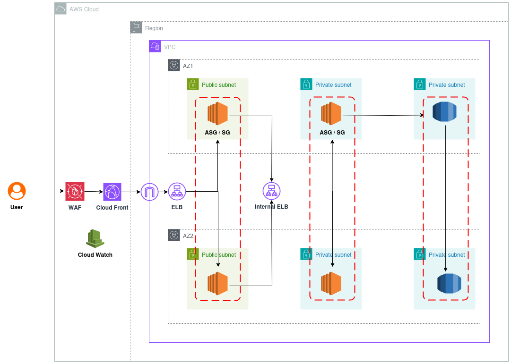

# 3-Tier Web Application on AWS using Terraform



This project builds a complete 3-tier web application infrastructure on AWS using Terraform. The architecture follows best practices in terms of security, scalability, and availability, and is built using modular Terraform code.

---

## 🧱 Project Structure

```
.
├── main.tf
├── variables.tf
├── terraform.tfvars
├── data.tf
├── manara.png
├── README.md
└── modules/
    ├── 01-vpc/
    ├── 02-security_groups/
    ├── 03-key_pair/
    ├── 04-frontend/
    ├── 05-backend/
    ├── 06-database/
    ├── 07-cloudwatch/
    ├── 08-cloudfront/
    └── 09-auto_scaling_group/
```

---

## 📌 Project Goal

To deploy a web application with:
- A **public-facing frontend** hosted on EC2.
- A **secured backend** layer handling the logic.
- A **private database layer** using RDS.
- Full **observability** and **autoscaling** setup.
- Secure and optimized access via **CloudFront** and **WAF**.

---

## 🧩 Services and Their Purpose

### 1. **VPC (Virtual Private Cloud)**  
Creates a logically isolated network where all resources are deployed.  
Divides the infrastructure into **public and private subnets**, allowing full control over traffic flow.

### 2. **Security Groups**  
Acts as virtual firewalls controlling inbound and outbound traffic:  
- Frontend: Only HTTP/HTTPS allowed from the internet.  
- Backend: Only accepts requests from frontend layer.  
- Database: Only accessible by backend EC2.

### 3. **Key Pair**  
Used for SSH access to EC2 instances (mainly during development or troubleshooting). Stored securely and used in `aws_instance` resources.

### 4. **Frontend (EC2 in Public Subnet)**  
Hosts the client-facing part of the application (HTML/JS/React).  
Automatically launched via user data script with a web server like Nginx or Apache.

### 5. **Backend (EC2 in Private Subnet)**  
Handles business logic, API processing, and interacts with the database.  
Only reachable from the frontend via internal load balancer or direct security rules.

### 6. **Database (RDS - MySQL/PostgreSQL)**  
Relational database engine deployed in private subnets for maximum security.  
It stores all application data and is accessible only from backend EC2.

### 7. **CloudWatch**  
Enables monitoring and logging for EC2, ASG, and application health.  
Can be used to trigger alarms or auto-healing events.

### 8. **CloudFront**  
A Content Delivery Network (CDN) that caches frontend assets globally.  
Improves website load speed and adds a security layer.

### 9. **Auto Scaling Group (ASG)**  
Ensures the number of EC2 instances for frontend and backend scale in/out based on demand.  
Improves availability and reduces cost.

---

## 🚀 How to Deploy

```bash
terraform init           # Initialize the project
terraform plan           # Preview the changes
terraform apply          # Deploy the infrastructure
terraform destroy        # Tear down the environment
```

---

## ⚙️ Input Variables

Define your custom values in `terraform.tfvars`. Examples include:
- VPC CIDR block
- Subnet ranges
- Instance types
- Key pair name
- DB username/password

---

## 💡 Notes

- All resources are organized into modules to promote reusability.
- Backend and DB layers are **private**, unreachable directly from the internet.
- Logging and monitoring is implemented via **CloudWatch**.
- Project follows **infrastructure as code** and is fully reproducible.

---

## 👨‍💻 Author

Built with care as part of a hands-on project to demonstrate deep understanding of AWS and Terraform.  
Feel free to reach out for feedback or collaboration.
